# 数学复习笔记：从抛物线到斜坐标系

一条贯穿 **直角坐标 → 极坐标 → 向量 → 复数 → 斜坐标系** 的学习线索，配 18 张矢量图（SVG）与可复用的 Python 生成脚本。

> 完整文字笔记见 [复习笔记.txt](复习笔记.txt)（纯文本，公式用 `x^2`、`sqrt` 等好读写法）。
> 每张图都有对应的 `*.py` 脚本，改数值即可重新生成。

---

## 目录

1. [二次函数：交点、韦达、设点法](#一二次函数交点韦达设点法)
2. [极坐标的影子：方位角与解直角三角形](#二极坐标的影子方位角与解直角三角形)
3. [复数与极坐标](#三复数与极坐标)
4. [向量与极坐标](#四向量与极坐标)
5. [斜坐标系与向量](#五斜坐标系与向量)
6. [核心公式速查](#六核心公式速查)

---

## 一、二次函数：交点、韦达、设点法

| 图 | 说明 |
|---|---|
| 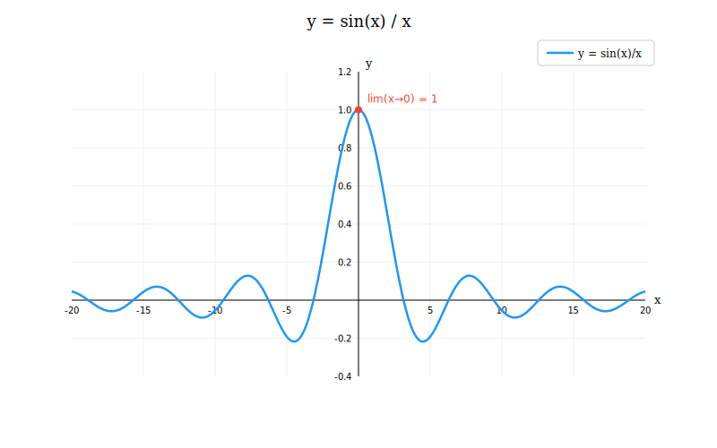 | `y = sin(x)/x`（sinc 函数），x→0 极限为 1 |
| 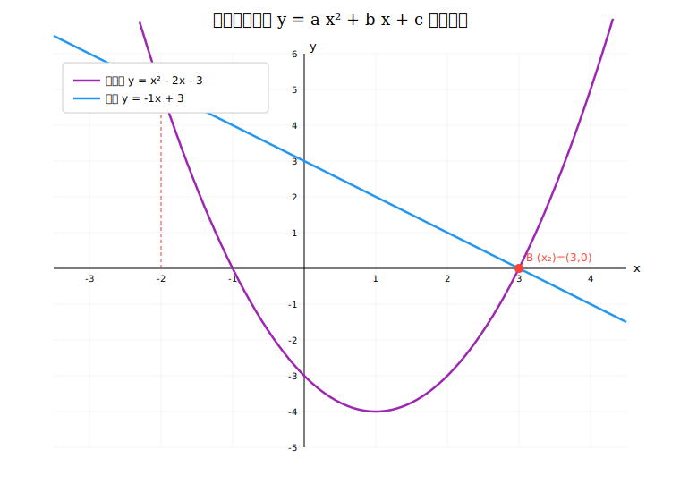 | 直线与抛物线两交点：`y = [a(x1+x2)+b]x + (c - a·x1·x2)` |
| 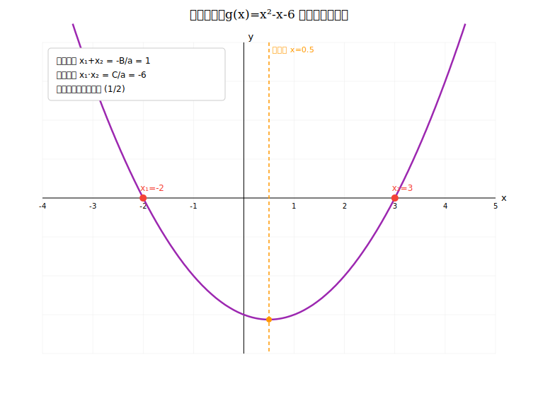 | 韦达定理：两根和 `-B/a`、积 `C/a`，对称轴在两根正中间 |
| 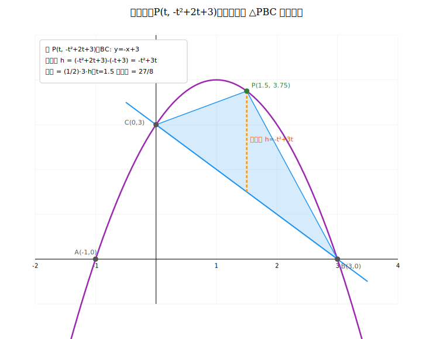 | 设点法 + 铅垂高求三角形最大面积 |
| 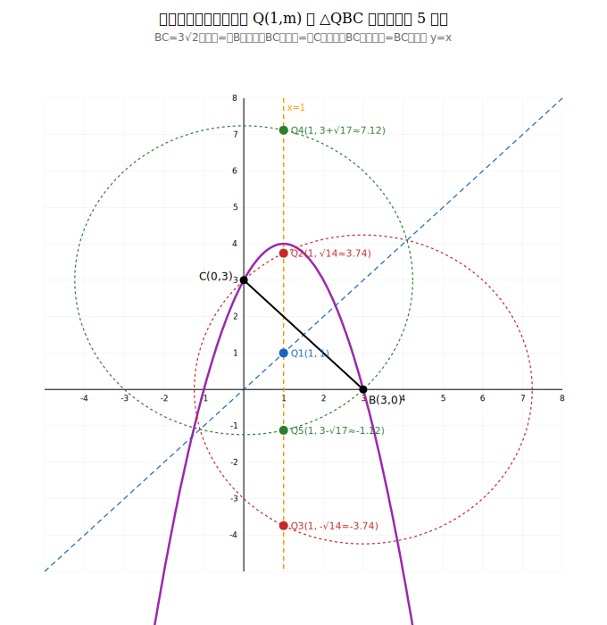 | 对称轴上设点，等腰三角形分类讨论（共 5 解） |
| 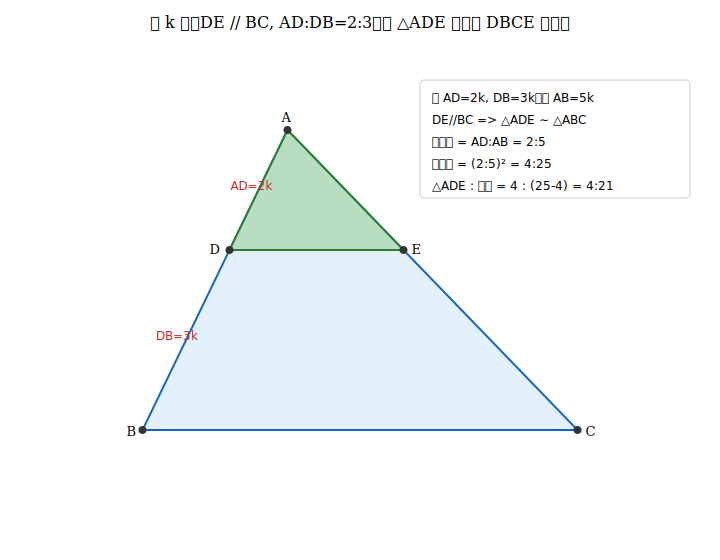 | 设 k 法解相似三角形面积比 |
| 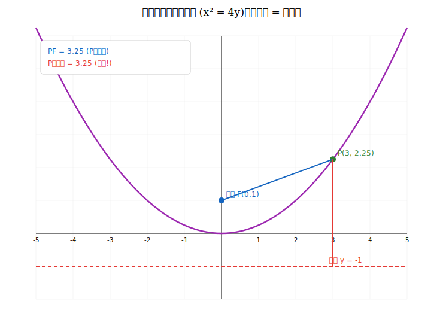 | 抛物线焦点与准线（高中圆锥曲线，初中不考） |

## 二、极坐标的影子：方位角与解直角三角形

极坐标 `(r, θ)` 是高中内容，但其灵魂「用距离+角度定位点」在初中就是解直角三角形：`x = r·cosθ, y = r·sinθ`。

| 图 | 说明 |
|---|---|
| 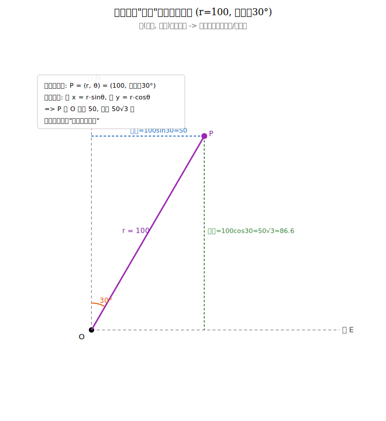 | 方位角 = 极坐标思想，拆成东/北分量 |
| 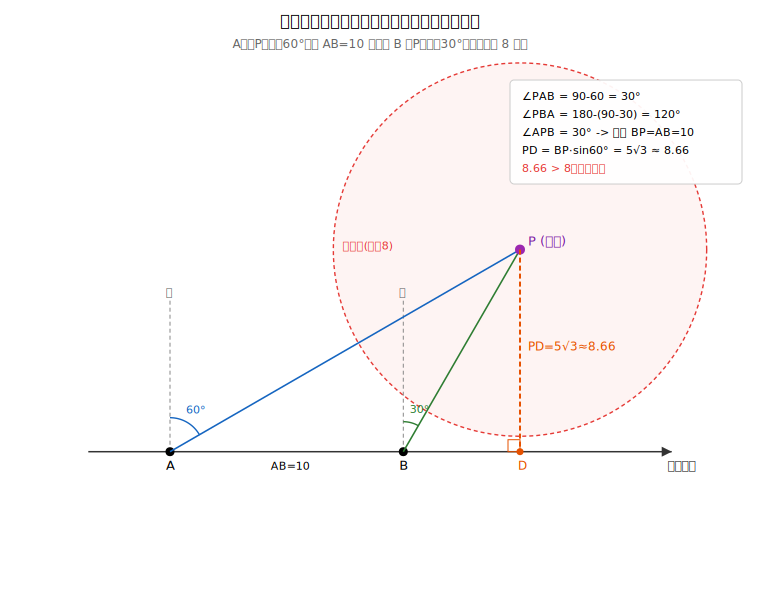 | 船是否触礁应用题：转角 → 等腰 → 作垂线 |

## 三、复数与极坐标

复数极坐标形式 `z = r(cosθ + i·sinθ) = r·e^(iθ)`；乘法 = 模相乘、幅角相加（旋转+伸缩）。

| 图 | 说明 |
|---|---|
| 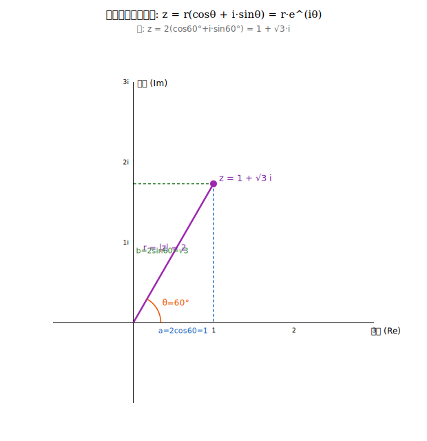 | 复数的模与幅角，实虚部 = `r·cosθ / r·sinθ` |
| 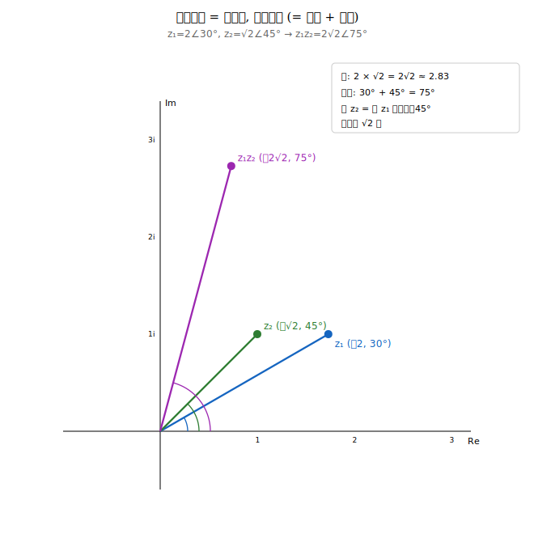 | `2∠30° × √2∠45° = 2√2∠75°`，乘以 i = 转 90° |

## 四、向量与极坐标

| 图 | 说明 |
|---|---|
| 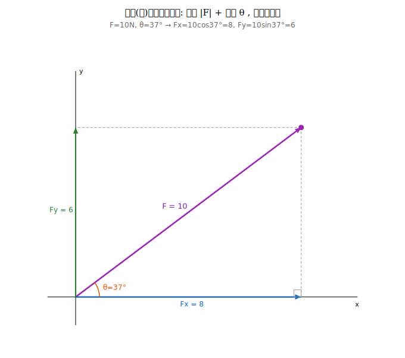 | 力的分解 `Fx = F·cosθ, Fy = F·sinθ`（F=10N,37° → 8,6） |
| 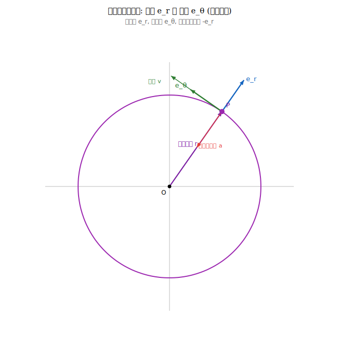 | 圆周运动的极坐标基底：位置沿 e_r、速度沿 e_θ、向心加速度沿 -e_r |

## 五、斜坐标系与向量

斜坐标系 = 用两个不垂直的基底 `e1, e2` 给平面定坐标（理论基础：平面向量基本定理）。

| 图 | 说明 |
|---|---|
| 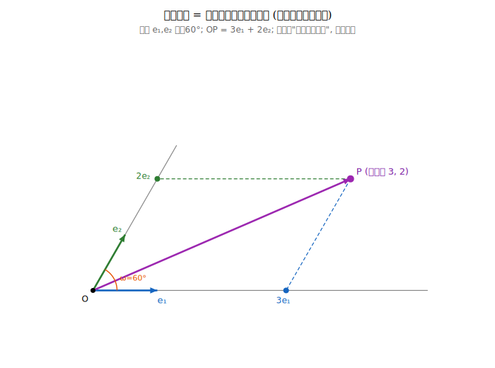 | 沿非正交基底分解向量（平行投影，非垂直） |
| 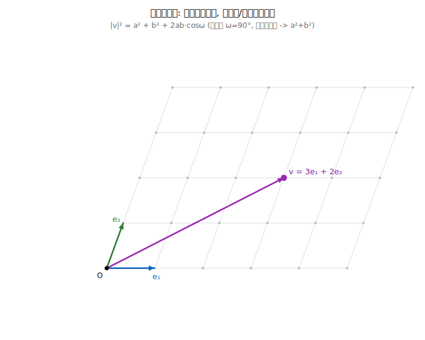 | 斜网格：线性运算照旧，长度公式带交叉项 |
| 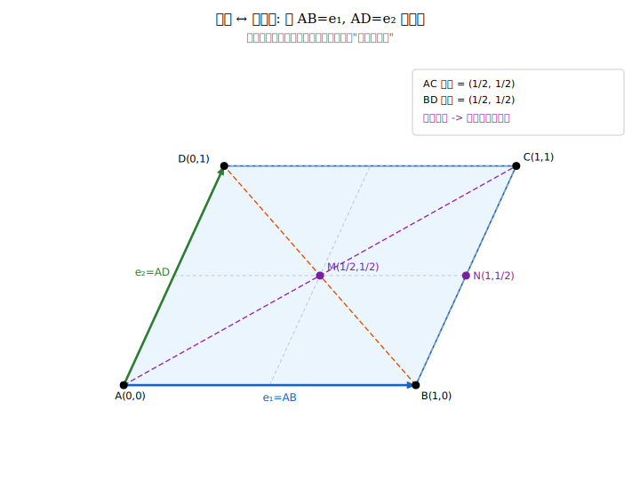 | 平行四边形坐标化为「单位正方形」 |
| 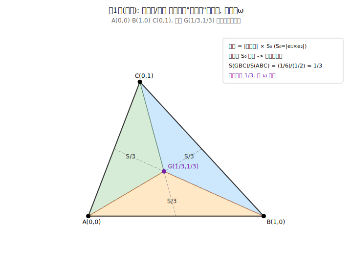 | **第一类（仿射）**：面积比 = 行列式之比，免 cosω |
| 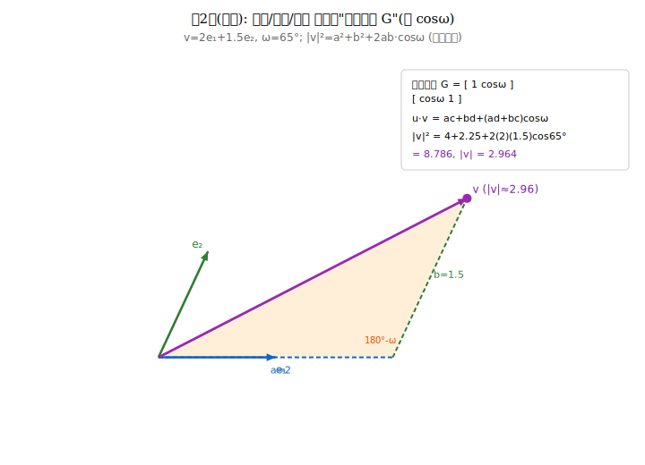 | **第二类（度量）**：长度/夹角需点积矩阵 G，带 cosω |
| 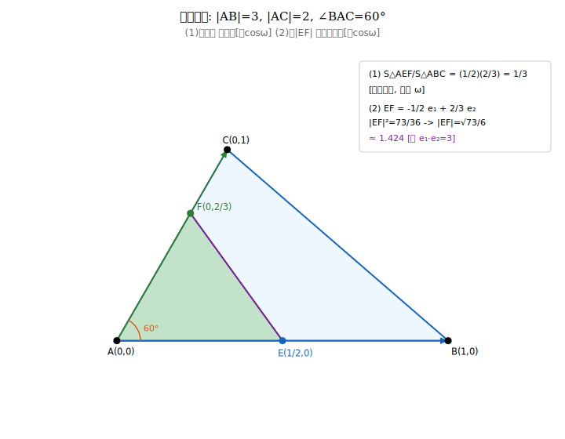 | 综合例题：面积比（仿射）+ 求 \|EF\|（度量）同题切换 |

---

## 六、核心公式速查

**两交点定直线**（抛物线 `y = ax²+bx+c`）
```
y = [a(x1+x2) + b]·x + (c - a·x1·x2)
```

**韦达定理**（`ax² + Bx + C = 0`）
```
x1 + x2 = -B/a      x1·x2 = C/a
```

**极坐标 / 向量 / 复数 共用的分量转换**
```
x = r·cosθ      y = r·sinθ
```

**斜坐标系：两大类**
```
仿射类（免 cosω，斜坐标可照搬直角系）：
  · 直线方程 ax+by+c=0
  · 共线判断 ad - bc = 0
  · 面积比 = 行列式之比（S0 抵消）
  · 取边为基底做坐标化

度量类（必须用点积矩阵 G，带 cosω）：
  · G = [[1, cosω],[cosω, 1]]（单位基底）
  · u·v = ac + bd + (ad+bc)·cosω
  · |v|² = x² + y² + 2xy·cosω
```

口诀：问「在不在线上 / 占多少比例」→ 放心用坐标；问「多长 / 多少度 / 是否垂直」→ 请出点积矩阵 G。

---

*笔记由学习对话整理而成。图像为纯 Python 标准库生成的 SVG，无第三方依赖。*
